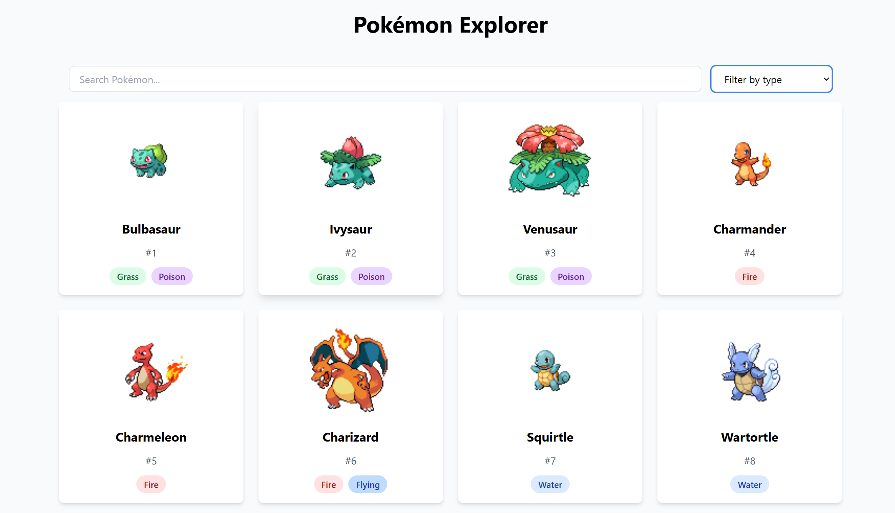

# Pokémon Explorer

An interactive web application that allows users to explore and search through Pokémon data from the PokeAPI. Built with React, Tailwind CSS, and Vite.



## Live Demo

[Deployed on Vercel](https://pokemon-explorer-liart.vercel.app/)

## Features

- Browse through the first 150 Pokémon
- Real-time search by Pokémon name
- Filter Pokémon by type
- Responsive design for all devices
- Beautiful card layout with Pokémon details
- Loading and error states
- Type-based color coding

## Features in Detail

### Data Display
- Pokémon name
- Official artwork
- ID number
- Type(s) with color-coded badges

### Search and Filter
- Real-time search by name
- Type-based filtering
- Combined search and filter functionality

### UI/UX
- Responsive grid layout
- Loading spinner
- Error handling
- Empty state messages
- Hover effects on cards
- Smooth transitions

## Project Structure

```
pokemon-explorer/
├── src/
│   ├── components/
│   │   ├── PokemonCard.jsx
│   │   └── SearchBar.jsx
│   ├── App.jsx
│   ├── main.jsx
│   └── index.css
├── public/
├── package.json
├── tailwind.config.js
├── postcss.config.js
└── README.md
```

## Tech Stack

- React 18
- Tailwind CSS
- Axios for API calls
- Vite for build tooling
- PokeAPI for Pokémon data

## Getting Started

### Prerequisites

- Node.js (v14 or higher)
- npm (v6 or higher)

### Installation

1. Clone the repository:
```bash
git clone https://github.com/noviciusss/pokemon-explorer.git
cd pokemon-explorer
```

2. Install dependencies:
```bash
npm install
```

3. Start the development server:
```bash
npm run dev
```

4. Open your browser and navigate to `http://localhost:5173`

## API Integration

The application uses the [PokeAPI](https://pokeapi.co/) to fetch Pokémon data:
- Base URL: `https://pokeapi.co/api/v2`
- Endpoints used:
  - `/pokemon?limit=150` - Get list of first 150 Pokémon
  - `/pokemon/{id}` - Get detailed Pokémon data


## Contributing

1. Fork the repository
2. Create your feature branch (`git checkout -b feature/amazing-feature`)
3. Commit your changes (`git commit -m 'Add some amazing feature'`)
4. Push to the branch (`git push origin feature/amazing-feature`)
5. Open a Pull Request

## License

This project is licensed under the MIT License - see the [LICENSE](LICENSE) file for details.

## Acknowledgments

- [PokeAPI](https://pokeapi.co/) for providing the Pokémon data

## Contact

Noviciusss - [@noviciusss](https://github.com/noviciusss)

Project Link: [https://github.com/noviciusss/pokemon-explorer](https://github.com/noviciusss/pokemon-explorer)
